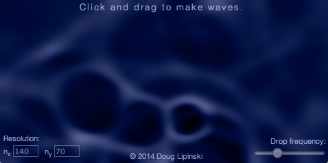

jsWAVES
===========================

## Javascript shallow water waves 

Screenshot:

A Javascript code for solving the shallow water equations and displaying the results using HTML5 canvas elements. User interaction is handled via mouse or touch events. You can play around with a working version [here](http://vonkarman.mae.ufl.edu/~dmlipinski/interactive/waves.html).

The file waves.html sets up the necessary HTML structure and loads waves.css for styling and jsWAVES.js which handles all additional tasks to solve the shallow water equations and handle browser/user events.

NOTE: This code relies heavily on the HTML5 canvas tag for all animation. This means that it will only work on modern browsers with good support for canvas operations as well as the requestAnimationFrame() method. It has been tested on the most recent versions of Chrome, Firefox, and Safari.

All code is released under the FreeBSD license.
